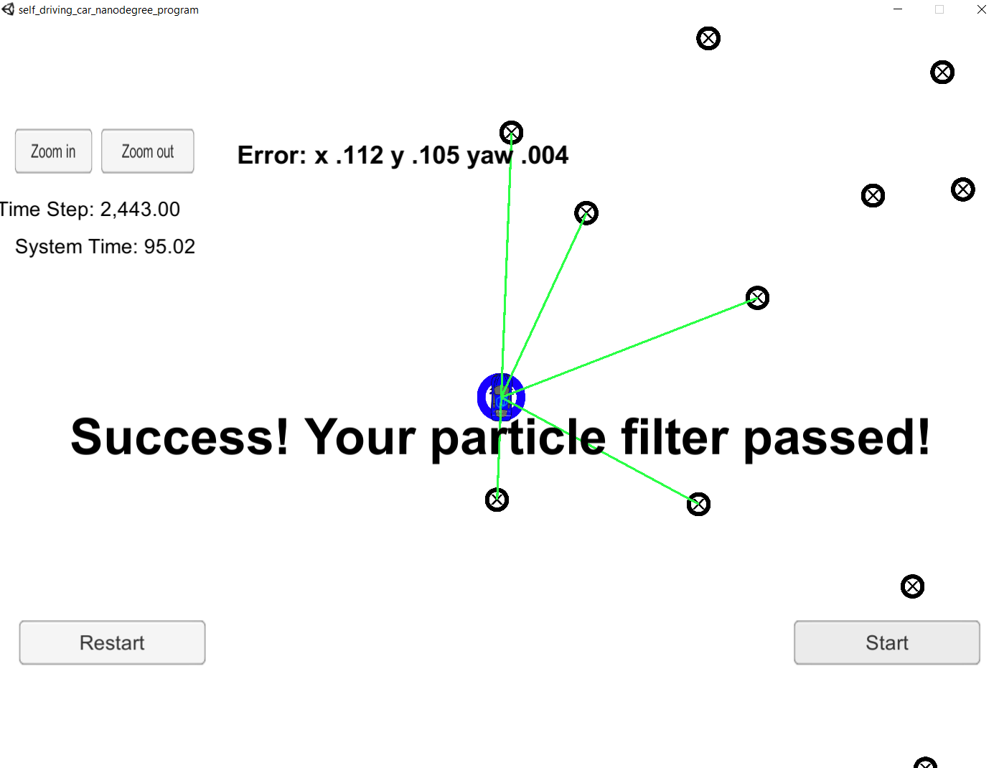

#**Kidnapped Vehicle**
[](http://www.udacity.com/drive)



# Overview
This repository is the completed final project for the Localization course in Udacity's Self-Driving Car Nanodegree.  Called the Kidnapped Vehicle project, the goal is to use a particle filter to help the robot locate itself based on a map and observations of surrounding landmarks.

#### Submission
This submission contains a number of files, but the one of interest is /src/particle_filter.cpp, the only one with changes from the provided project framework code.

## Project Introduction
Our robot has been kidnapped and transported to a new location! Luckily it has a map of this location it can use to figure out where that is..

In this project a 2 dimensional particle filter (written in C++) will help the robot locate itself. The particle filter starts with a map and that initial localization information (analogous to what a GPS would provide). At each time step the filter will also get observation and control data. 

## Running the Code
This project relies on the Term 2 Simulator which can be downloaded [here](https://github.com/udacity/self-driving-car-sim/releases)

This repository includes two files that can be used to set up and intall uWebSocketIO for either Linux or Mac systems. For windows you can use either Docker, VMware, or even Windows 10 Bash on Ubuntu to install uWebSocketIO.

Once the install for uWebSocketIO is complete, the main program can be built and run by doing the following from the project top directory.

./build.sh
./run.sh

The main body of the program is housed in main.cpp, which relies on the following data structures along with uWebSocketIO to communicate with the simulator.

INPUT: values provided by the simulator to the c++ program

// sense noisy position data from the simulator

["sense_x"] 

["sense_y"] 

["sense_theta"] 

// get the previous velocity and yaw rate to predict the particle's transitioned state

["previous_velocity"]

["previous_yawrate"]

// receive noisy observation data from the simulator, in a respective list of x/y values

["sense_observations_x"] 

["sense_observations_y"] 


OUTPUT: values provided by the c++ program to the simulator

// best particle values used for calculating the error evaluation

["best_particle_x"]

["best_particle_y"]

["best_particle_theta"] 


# Implementing the Particle Filter
The directory structure of this repository is as follows:

```
root
|   build.sh
|   clean.sh
|   CMakeLists.txt
|   README.md
|   run.sh
|
|___data
|   |   
|   |   map_data.txt
|   
|   
|___src
    |   helper_functions.h
    |   main.cpp
    |   map.h
    |   particle_filter.cpp
    |   particle_filter.h
```

The only file modified for this project was `particle_filter.cpp` in the `src` directory. The file began with the scaffolding of a `ParticleFilter` class and some associated methods. The methods were built out following the process and formulas discussed in the Particle Filter lessons, the Kidnapped Vehicle Q&A online video, and discussions in the class forums.  

## Inputs to the Particle Filter

You can find the inputs to the particle filter in the `data` directory. 

#### The Map*
`map_data.txt` includes the position of landmarks (in meters) on an arbitrary Cartesian coordinate system. Each row has three columns
1. x position
2. y position
3. landmark id

### All other data the simulator provides, such as observations and controls.

> * Map data provided by 3D Mapping Solutions GmbH.

## Ruberic

There are three main points for acheiving success for this project, as desribed by the [project ruberic](https://review.udacity.com/#!/rubrics/747/view):

# Accuracy

 The particle filter should localize vehicle position and yaw to within the values specified in the parameters `max_translation_error` and `max_yaw_error` in `src/main.cpp`; when the simulator shows " Success! Your particle filter passed!" then the criteria has been met..

# Performance

 The particle filter should complete execution within the time of 100 seconds.  This is checked automatically by the simulator.

# General

 Does the code use a particle filter to localize the robot?  While it is possible to locate the robot's position using methods other than a particle filter, that would defeat the purpose of this exercise.  This project does rely on a particle filter, as required.

# Other thoughts

This project relied heavily on translating equations to code, which proved somewhat difficult.  While the code itself is not complex, understanding the meaning of the formulas discussed in the lessons was the most time consuming step.  How the data structure fit those formulas, how to address individual or groups of data points without encountering unexpected errors was the real challenge.  In one case, a seemingly easy solution to finding a minimum distance "nearest neighbor" landmark by simply keeping track of the closest landmark during the calculation step and updating it whenever the current landmark proved closer than the previously saved value, resulted in a seg fault which was not easily resolved.  Instead, replacing that login with the function calls distance(), begin(), and end() find the nearest neighbor after the fact was a faster solution to the problem.
